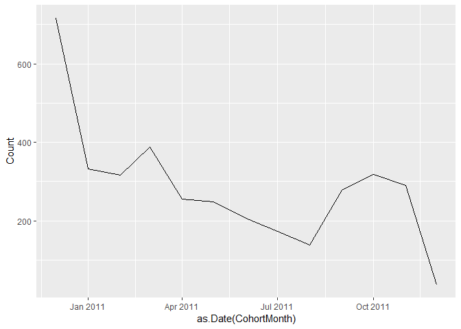
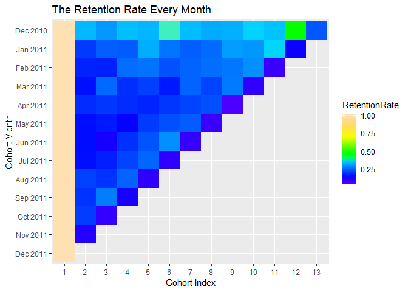
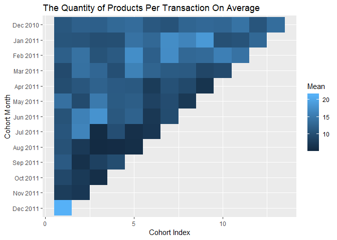
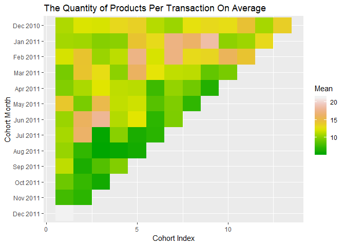

Cohort Analysis Using R
================
Haojin Jia
June 4, 2019

Acquisition Size
----------------

As starter, let us define the variables. CohortMonth is the month when a group of users registered. For example, Dec 2010 is the month that this batch of customers registered. CohortIndex is the number of month since they registered. For example, 2 is the second month after they registered.

With these definitions, obviously, the CohortIndex "1" represents the size of acquisition.

<table class="table table-condensed">
<thead>
<tr>
<th style="text-align:right;">
CohortMonth
</th>
<th style="text-align:right;">
1
</th>
<th style="text-align:right;">
2
</th>
<th style="text-align:right;">
3
</th>
<th style="text-align:right;">
4
</th>
<th style="text-align:right;">
5
</th>
<th style="text-align:right;">
6
</th>
<th style="text-align:right;">
7
</th>
<th style="text-align:right;">
8
</th>
<th style="text-align:right;">
9
</th>
<th style="text-align:right;">
10
</th>
<th style="text-align:right;">
11
</th>
<th style="text-align:right;">
12
</th>
<th style="text-align:right;">
13
</th>
</tr>
</thead>
<tbody>
<tr>
<td style="text-align:right;">
Dec 2010
</td>
<td style="text-align:right;">
716
</td>
<td style="text-align:right;">
246
</td>
<td style="text-align:right;">
221
</td>
<td style="text-align:right;">
251
</td>
<td style="text-align:right;">
245
</td>
<td style="text-align:right;">
285
</td>
<td style="text-align:right;">
249
</td>
<td style="text-align:right;">
236
</td>
<td style="text-align:right;">
240
</td>
<td style="text-align:right;">
265
</td>
<td style="text-align:right;">
254
</td>
<td style="text-align:right;">
348
</td>
<td style="text-align:right;">
172
</td>
</tr>
<tr>
<td style="text-align:right;">
Jan 2011
</td>
<td style="text-align:right;">
332
</td>
<td style="text-align:right;">
69
</td>
<td style="text-align:right;">
82
</td>
<td style="text-align:right;">
81
</td>
<td style="text-align:right;">
110
</td>
<td style="text-align:right;">
90
</td>
<td style="text-align:right;">
82
</td>
<td style="text-align:right;">
86
</td>
<td style="text-align:right;">
104
</td>
<td style="text-align:right;">
102
</td>
<td style="text-align:right;">
124
</td>
<td style="text-align:right;">
45
</td>
<td style="text-align:right;">
NA
</td>
</tr>
<tr>
<td style="text-align:right;">
Feb 2011
</td>
<td style="text-align:right;">
316
</td>
<td style="text-align:right;">
58
</td>
<td style="text-align:right;">
57
</td>
<td style="text-align:right;">
83
</td>
<td style="text-align:right;">
85
</td>
<td style="text-align:right;">
74
</td>
<td style="text-align:right;">
80
</td>
<td style="text-align:right;">
83
</td>
<td style="text-align:right;">
86
</td>
<td style="text-align:right;">
95
</td>
<td style="text-align:right;">
28
</td>
<td style="text-align:right;">
NA
</td>
<td style="text-align:right;">
NA
</td>
</tr>
<tr>
<td style="text-align:right;">
Mar 2011
</td>
<td style="text-align:right;">
388
</td>
<td style="text-align:right;">
63
</td>
<td style="text-align:right;">
100
</td>
<td style="text-align:right;">
76
</td>
<td style="text-align:right;">
83
</td>
<td style="text-align:right;">
67
</td>
<td style="text-align:right;">
98
</td>
<td style="text-align:right;">
85
</td>
<td style="text-align:right;">
107
</td>
<td style="text-align:right;">
38
</td>
<td style="text-align:right;">
NA
</td>
<td style="text-align:right;">
NA
</td>
<td style="text-align:right;">
NA
</td>
</tr>
<tr>
<td style="text-align:right;">
Apr 2011
</td>
<td style="text-align:right;">
255
</td>
<td style="text-align:right;">
49
</td>
<td style="text-align:right;">
52
</td>
<td style="text-align:right;">
49
</td>
<td style="text-align:right;">
47
</td>
<td style="text-align:right;">
52
</td>
<td style="text-align:right;">
56
</td>
<td style="text-align:right;">
59
</td>
<td style="text-align:right;">
17
</td>
<td style="text-align:right;">
NA
</td>
<td style="text-align:right;">
NA
</td>
<td style="text-align:right;">
NA
</td>
<td style="text-align:right;">
NA
</td>
</tr>
<tr>
<td style="text-align:right;">
May 2011
</td>
<td style="text-align:right;">
249
</td>
<td style="text-align:right;">
40
</td>
<td style="text-align:right;">
43
</td>
<td style="text-align:right;">
36
</td>
<td style="text-align:right;">
52
</td>
<td style="text-align:right;">
58
</td>
<td style="text-align:right;">
61
</td>
<td style="text-align:right;">
22
</td>
<td style="text-align:right;">
NA
</td>
<td style="text-align:right;">
NA
</td>
<td style="text-align:right;">
NA
</td>
<td style="text-align:right;">
NA
</td>
<td style="text-align:right;">
NA
</td>
</tr>
<tr>
<td style="text-align:right;">
Jun 2011
</td>
<td style="text-align:right;">
207
</td>
<td style="text-align:right;">
33
</td>
<td style="text-align:right;">
26
</td>
<td style="text-align:right;">
41
</td>
<td style="text-align:right;">
49
</td>
<td style="text-align:right;">
62
</td>
<td style="text-align:right;">
19
</td>
<td style="text-align:right;">
NA
</td>
<td style="text-align:right;">
NA
</td>
<td style="text-align:right;">
NA
</td>
<td style="text-align:right;">
NA
</td>
<td style="text-align:right;">
NA
</td>
<td style="text-align:right;">
NA
</td>
</tr>
<tr>
<td style="text-align:right;">
Jul 2011
</td>
<td style="text-align:right;">
173
</td>
<td style="text-align:right;">
28
</td>
<td style="text-align:right;">
31
</td>
<td style="text-align:right;">
38
</td>
<td style="text-align:right;">
44
</td>
<td style="text-align:right;">
17
</td>
<td style="text-align:right;">
NA
</td>
<td style="text-align:right;">
NA
</td>
<td style="text-align:right;">
NA
</td>
<td style="text-align:right;">
NA
</td>
<td style="text-align:right;">
NA
</td>
<td style="text-align:right;">
NA
</td>
<td style="text-align:right;">
NA
</td>
</tr>
<tr>
<td style="text-align:right;">
Aug 2011
</td>
<td style="text-align:right;">
139
</td>
<td style="text-align:right;">
30
</td>
<td style="text-align:right;">
28
</td>
<td style="text-align:right;">
35
</td>
<td style="text-align:right;">
14
</td>
<td style="text-align:right;">
NA
</td>
<td style="text-align:right;">
NA
</td>
<td style="text-align:right;">
NA
</td>
<td style="text-align:right;">
NA
</td>
<td style="text-align:right;">
NA
</td>
<td style="text-align:right;">
NA
</td>
<td style="text-align:right;">
NA
</td>
<td style="text-align:right;">
NA
</td>
</tr>
<tr>
<td style="text-align:right;">
Sep 2011
</td>
<td style="text-align:right;">
279
</td>
<td style="text-align:right;">
56
</td>
<td style="text-align:right;">
78
</td>
<td style="text-align:right;">
34
</td>
<td style="text-align:right;">
NA
</td>
<td style="text-align:right;">
NA
</td>
<td style="text-align:right;">
NA
</td>
<td style="text-align:right;">
NA
</td>
<td style="text-align:right;">
NA
</td>
<td style="text-align:right;">
NA
</td>
<td style="text-align:right;">
NA
</td>
<td style="text-align:right;">
NA
</td>
<td style="text-align:right;">
NA
</td>
</tr>
<tr>
<td style="text-align:right;">
Oct 2011
</td>
<td style="text-align:right;">
318
</td>
<td style="text-align:right;">
67
</td>
<td style="text-align:right;">
30
</td>
<td style="text-align:right;">
NA
</td>
<td style="text-align:right;">
NA
</td>
<td style="text-align:right;">
NA
</td>
<td style="text-align:right;">
NA
</td>
<td style="text-align:right;">
NA
</td>
<td style="text-align:right;">
NA
</td>
<td style="text-align:right;">
NA
</td>
<td style="text-align:right;">
NA
</td>
<td style="text-align:right;">
NA
</td>
<td style="text-align:right;">
NA
</td>
</tr>
<tr>
<td style="text-align:right;">
Nov 2011
</td>
<td style="text-align:right;">
291
</td>
<td style="text-align:right;">
32
</td>
<td style="text-align:right;">
NA
</td>
<td style="text-align:right;">
NA
</td>
<td style="text-align:right;">
NA
</td>
<td style="text-align:right;">
NA
</td>
<td style="text-align:right;">
NA
</td>
<td style="text-align:right;">
NA
</td>
<td style="text-align:right;">
NA
</td>
<td style="text-align:right;">
NA
</td>
<td style="text-align:right;">
NA
</td>
<td style="text-align:right;">
NA
</td>
<td style="text-align:right;">
NA
</td>
</tr>
<tr>
<td style="text-align:right;">
Dec 2011
</td>
<td style="text-align:right;">
38
</td>
<td style="text-align:right;">
NA
</td>
<td style="text-align:right;">
NA
</td>
<td style="text-align:right;">
NA
</td>
<td style="text-align:right;">
NA
</td>
<td style="text-align:right;">
NA
</td>
<td style="text-align:right;">
NA
</td>
<td style="text-align:right;">
NA
</td>
<td style="text-align:right;">
NA
</td>
<td style="text-align:right;">
NA
</td>
<td style="text-align:right;">
NA
</td>
<td style="text-align:right;">
NA
</td>
<td style="text-align:right;">
NA
</td>
</tr>
</tbody>
</table>

 

From this visual, the acquisition size decreased dramatically from Dec 2010. It seems that the ability to acquire new customers is decreasing dramatically. More information is needed about competitors and industry to conduct further analysis.

Retention Rate (%)
------------------

Let's delve into retention rate.

<table class="table table-condensed">
<thead>
<tr>
<th style="text-align:right;">
CohortMonth
</th>
<th style="text-align:right;">
1
</th>
<th style="text-align:right;">
2
</th>
<th style="text-align:right;">
3
</th>
<th style="text-align:right;">
4
</th>
<th style="text-align:right;">
5
</th>
<th style="text-align:right;">
6
</th>
<th style="text-align:right;">
7
</th>
<th style="text-align:right;">
8
</th>
<th style="text-align:right;">
9
</th>
<th style="text-align:right;">
10
</th>
<th style="text-align:right;">
11
</th>
<th style="text-align:right;">
12
</th>
<th style="text-align:right;">
13
</th>
</tr>
</thead>
<tbody>
<tr>
<td style="text-align:right;">
Dec 2010
</td>
<td style="text-align:right;">
100
</td>
<td style="text-align:right;">
34.35754
</td>
<td style="text-align:right;">
30.865922
</td>
<td style="text-align:right;">
35.05587
</td>
<td style="text-align:right;">
34.21788
</td>
<td style="text-align:right;">
39.80447
</td>
<td style="text-align:right;">
34.776536
</td>
<td style="text-align:right;">
32.960894
</td>
<td style="text-align:right;">
33.519553
</td>
<td style="text-align:right;">
37.011173
</td>
<td style="text-align:right;">
35.474860
</td>
<td style="text-align:right;">
48.60335
</td>
<td style="text-align:right;">
24.02235
</td>
</tr>
<tr>
<td style="text-align:right;">
Jan 2011
</td>
<td style="text-align:right;">
100
</td>
<td style="text-align:right;">
20.78313
</td>
<td style="text-align:right;">
24.698795
</td>
<td style="text-align:right;">
24.39759
</td>
<td style="text-align:right;">
33.13253
</td>
<td style="text-align:right;">
27.10843
</td>
<td style="text-align:right;">
24.698795
</td>
<td style="text-align:right;">
25.903614
</td>
<td style="text-align:right;">
31.325301
</td>
<td style="text-align:right;">
30.722892
</td>
<td style="text-align:right;">
37.349398
</td>
<td style="text-align:right;">
13.55422
</td>
<td style="text-align:right;">
NA
</td>
</tr>
<tr>
<td style="text-align:right;">
Feb 2011
</td>
<td style="text-align:right;">
100
</td>
<td style="text-align:right;">
18.35443
</td>
<td style="text-align:right;">
18.037975
</td>
<td style="text-align:right;">
26.26582
</td>
<td style="text-align:right;">
26.89873
</td>
<td style="text-align:right;">
23.41772
</td>
<td style="text-align:right;">
25.316456
</td>
<td style="text-align:right;">
26.265823
</td>
<td style="text-align:right;">
27.215190
</td>
<td style="text-align:right;">
30.063291
</td>
<td style="text-align:right;">
8.860759
</td>
<td style="text-align:right;">
NA
</td>
<td style="text-align:right;">
NA
</td>
</tr>
<tr>
<td style="text-align:right;">
Mar 2011
</td>
<td style="text-align:right;">
100
</td>
<td style="text-align:right;">
16.23711
</td>
<td style="text-align:right;">
25.773196
</td>
<td style="text-align:right;">
19.58763
</td>
<td style="text-align:right;">
21.39175
</td>
<td style="text-align:right;">
17.26804
</td>
<td style="text-align:right;">
25.257732
</td>
<td style="text-align:right;">
21.907216
</td>
<td style="text-align:right;">
27.577320
</td>
<td style="text-align:right;">
9.793814
</td>
<td style="text-align:right;">
NA
</td>
<td style="text-align:right;">
NA
</td>
<td style="text-align:right;">
NA
</td>
</tr>
<tr>
<td style="text-align:right;">
Apr 2011
</td>
<td style="text-align:right;">
100
</td>
<td style="text-align:right;">
19.21569
</td>
<td style="text-align:right;">
20.392157
</td>
<td style="text-align:right;">
19.21569
</td>
<td style="text-align:right;">
18.43137
</td>
<td style="text-align:right;">
20.39216
</td>
<td style="text-align:right;">
21.960784
</td>
<td style="text-align:right;">
23.137255
</td>
<td style="text-align:right;">
6.666667
</td>
<td style="text-align:right;">
NA
</td>
<td style="text-align:right;">
NA
</td>
<td style="text-align:right;">
NA
</td>
<td style="text-align:right;">
NA
</td>
</tr>
<tr>
<td style="text-align:right;">
May 2011
</td>
<td style="text-align:right;">
100
</td>
<td style="text-align:right;">
16.06426
</td>
<td style="text-align:right;">
17.269076
</td>
<td style="text-align:right;">
14.45783
</td>
<td style="text-align:right;">
20.88353
</td>
<td style="text-align:right;">
23.29317
</td>
<td style="text-align:right;">
24.497992
</td>
<td style="text-align:right;">
8.835341
</td>
<td style="text-align:right;">
NA
</td>
<td style="text-align:right;">
NA
</td>
<td style="text-align:right;">
NA
</td>
<td style="text-align:right;">
NA
</td>
<td style="text-align:right;">
NA
</td>
</tr>
<tr>
<td style="text-align:right;">
Jun 2011
</td>
<td style="text-align:right;">
100
</td>
<td style="text-align:right;">
15.94203
</td>
<td style="text-align:right;">
12.560386
</td>
<td style="text-align:right;">
19.80676
</td>
<td style="text-align:right;">
23.67150
</td>
<td style="text-align:right;">
29.95169
</td>
<td style="text-align:right;">
9.178744
</td>
<td style="text-align:right;">
NA
</td>
<td style="text-align:right;">
NA
</td>
<td style="text-align:right;">
NA
</td>
<td style="text-align:right;">
NA
</td>
<td style="text-align:right;">
NA
</td>
<td style="text-align:right;">
NA
</td>
</tr>
<tr>
<td style="text-align:right;">
Jul 2011
</td>
<td style="text-align:right;">
100
</td>
<td style="text-align:right;">
16.18497
</td>
<td style="text-align:right;">
17.919075
</td>
<td style="text-align:right;">
21.96532
</td>
<td style="text-align:right;">
25.43353
</td>
<td style="text-align:right;">
9.82659
</td>
<td style="text-align:right;">
NA
</td>
<td style="text-align:right;">
NA
</td>
<td style="text-align:right;">
NA
</td>
<td style="text-align:right;">
NA
</td>
<td style="text-align:right;">
NA
</td>
<td style="text-align:right;">
NA
</td>
<td style="text-align:right;">
NA
</td>
</tr>
<tr>
<td style="text-align:right;">
Aug 2011
</td>
<td style="text-align:right;">
100
</td>
<td style="text-align:right;">
21.58273
</td>
<td style="text-align:right;">
20.143885
</td>
<td style="text-align:right;">
25.17986
</td>
<td style="text-align:right;">
10.07194
</td>
<td style="text-align:right;">
NA
</td>
<td style="text-align:right;">
NA
</td>
<td style="text-align:right;">
NA
</td>
<td style="text-align:right;">
NA
</td>
<td style="text-align:right;">
NA
</td>
<td style="text-align:right;">
NA
</td>
<td style="text-align:right;">
NA
</td>
<td style="text-align:right;">
NA
</td>
</tr>
<tr>
<td style="text-align:right;">
Sep 2011
</td>
<td style="text-align:right;">
100
</td>
<td style="text-align:right;">
20.07168
</td>
<td style="text-align:right;">
27.956989
</td>
<td style="text-align:right;">
12.18638
</td>
<td style="text-align:right;">
NA
</td>
<td style="text-align:right;">
NA
</td>
<td style="text-align:right;">
NA
</td>
<td style="text-align:right;">
NA
</td>
<td style="text-align:right;">
NA
</td>
<td style="text-align:right;">
NA
</td>
<td style="text-align:right;">
NA
</td>
<td style="text-align:right;">
NA
</td>
<td style="text-align:right;">
NA
</td>
</tr>
<tr>
<td style="text-align:right;">
Oct 2011
</td>
<td style="text-align:right;">
100
</td>
<td style="text-align:right;">
21.06918
</td>
<td style="text-align:right;">
9.433962
</td>
<td style="text-align:right;">
NA
</td>
<td style="text-align:right;">
NA
</td>
<td style="text-align:right;">
NA
</td>
<td style="text-align:right;">
NA
</td>
<td style="text-align:right;">
NA
</td>
<td style="text-align:right;">
NA
</td>
<td style="text-align:right;">
NA
</td>
<td style="text-align:right;">
NA
</td>
<td style="text-align:right;">
NA
</td>
<td style="text-align:right;">
NA
</td>
</tr>
<tr>
<td style="text-align:right;">
Nov 2011
</td>
<td style="text-align:right;">
100
</td>
<td style="text-align:right;">
10.99656
</td>
<td style="text-align:right;">
NA
</td>
<td style="text-align:right;">
NA
</td>
<td style="text-align:right;">
NA
</td>
<td style="text-align:right;">
NA
</td>
<td style="text-align:right;">
NA
</td>
<td style="text-align:right;">
NA
</td>
<td style="text-align:right;">
NA
</td>
<td style="text-align:right;">
NA
</td>
<td style="text-align:right;">
NA
</td>
<td style="text-align:right;">
NA
</td>
<td style="text-align:right;">
NA
</td>
</tr>
<tr>
<td style="text-align:right;">
Dec 2011
</td>
<td style="text-align:right;">
100
</td>
<td style="text-align:right;">
NA
</td>
<td style="text-align:right;">
NA
</td>
<td style="text-align:right;">
NA
</td>
<td style="text-align:right;">
NA
</td>
<td style="text-align:right;">
NA
</td>
<td style="text-align:right;">
NA
</td>
<td style="text-align:right;">
NA
</td>
<td style="text-align:right;">
NA
</td>
<td style="text-align:right;">
NA
</td>
<td style="text-align:right;">
NA
</td>
<td style="text-align:right;">
NA
</td>
<td style="text-align:right;">
NA
</td>
</tr>
</tbody>
</table>

 

Retention Rate change of every cohort
-------------------------------------

  Red Flag: all cohorts decreased at the end of their cohort 

Index, which is Dec 2011. One should be warned to check what happen in that month. Ideally, as time goes, the retention rate should flatten out, which indicates customer adherence to this retailer, otherwise they should learn what is the sweet point the retailer provides for their customers.

Note: This graph is interactive: feel free to double click specific cohort on legend to conceal other cohorts. With this reason, md file may not be able to see this effect.

Analyze the quantity of products on average every transaction has
-----------------------------------------------------------------

<table class="table table-condensed">
<thead>
<tr>
<th style="text-align:right;">
CohortMonth
</th>
<th style="text-align:right;">
1
</th>
<th style="text-align:right;">
2
</th>
<th style="text-align:right;">
3
</th>
<th style="text-align:right;">
4
</th>
<th style="text-align:right;">
5
</th>
<th style="text-align:right;">
6
</th>
<th style="text-align:right;">
7
</th>
<th style="text-align:right;">
8
</th>
<th style="text-align:right;">
9
</th>
<th style="text-align:right;">
10
</th>
<th style="text-align:right;">
11
</th>
<th style="text-align:right;">
12
</th>
<th style="text-align:right;">
13
</th>
</tr>
</thead>
<tbody>
<tr>
<td style="text-align:right;">
Dec 2010
</td>
<td style="text-align:right;">
11.111588
</td>
<td style="text-align:right;">
12.260241
</td>
<td style="text-align:right;">
12.152314
</td>
<td style="text-align:right;">
13.228676
</td>
<td style="text-align:right;">
13.669839
</td>
<td style="text-align:right;">
11.288630
</td>
<td style="text-align:right;">
10.620746
</td>
<td style="text-align:right;">
12.783798
</td>
<td style="text-align:right;">
13.207415
</td>
<td style="text-align:right;">
12.985885
</td>
<td style="text-align:right;">
14.46231
</td>
<td style="text-align:right;">
10.91979
</td>
<td style="text-align:right;">
13.73356
</td>
</tr>
<tr>
<td style="text-align:right;">
Jan 2011
</td>
<td style="text-align:right;">
10.881771
</td>
<td style="text-align:right;">
10.769231
</td>
<td style="text-align:right;">
9.984436
</td>
<td style="text-align:right;">
10.118644
</td>
<td style="text-align:right;">
14.344288
</td>
<td style="text-align:right;">
13.155340
</td>
<td style="text-align:right;">
17.369835
</td>
<td style="text-align:right;">
16.384477
</td>
<td style="text-align:right;">
18.680822
</td>
<td style="text-align:right;">
10.226368
</td>
<td style="text-align:right;">
10.67580
</td>
<td style="text-align:right;">
13.20068
</td>
<td style="text-align:right;">
NA
</td>
</tr>
<tr>
<td style="text-align:right;">
Feb 2011
</td>
<td style="text-align:right;">
12.117201
</td>
<td style="text-align:right;">
14.295139
</td>
<td style="text-align:right;">
10.598131
</td>
<td style="text-align:right;">
11.475375
</td>
<td style="text-align:right;">
17.472727
</td>
<td style="text-align:right;">
12.153203
</td>
<td style="text-align:right;">
17.310811
</td>
<td style="text-align:right;">
13.166052
</td>
<td style="text-align:right;">
13.413121
</td>
<td style="text-align:right;">
15.883848
</td>
<td style="text-align:right;">
14.33981
</td>
<td style="text-align:right;">
NA
</td>
<td style="text-align:right;">
NA
</td>
</tr>
<tr>
<td style="text-align:right;">
Mar 2011
</td>
<td style="text-align:right;">
9.558752
</td>
<td style="text-align:right;">
14.244681
</td>
<td style="text-align:right;">
12.968401
</td>
<td style="text-align:right;">
10.173302
</td>
<td style="text-align:right;">
16.114035
</td>
<td style="text-align:right;">
12.664269
</td>
<td style="text-align:right;">
11.575985
</td>
<td style="text-align:right;">
11.452229
</td>
<td style="text-align:right;">
8.996483
</td>
<td style="text-align:right;">
9.587678
</td>
<td style="text-align:right;">
NA
</td>
<td style="text-align:right;">
NA
</td>
<td style="text-align:right;">
NA
</td>
</tr>
<tr>
<td style="text-align:right;">
Apr 2011
</td>
<td style="text-align:right;">
9.867816
</td>
<td style="text-align:right;">
11.052632
</td>
<td style="text-align:right;">
12.421277
</td>
<td style="text-align:right;">
11.521930
</td>
<td style="text-align:right;">
11.389091
</td>
<td style="text-align:right;">
7.693878
</td>
<td style="text-align:right;">
10.406332
</td>
<td style="text-align:right;">
9.378378
</td>
<td style="text-align:right;">
6.644444
</td>
<td style="text-align:right;">
NA
</td>
<td style="text-align:right;">
NA
</td>
<td style="text-align:right;">
NA
</td>
<td style="text-align:right;">
NA
</td>
</tr>
<tr>
<td style="text-align:right;">
May 2011
</td>
<td style="text-align:right;">
14.114890
</td>
<td style="text-align:right;">
9.615023
</td>
<td style="text-align:right;">
15.275641
</td>
<td style="text-align:right;">
11.579618
</td>
<td style="text-align:right;">
11.929054
</td>
<td style="text-align:right;">
8.507653
</td>
<td style="text-align:right;">
9.786787
</td>
<td style="text-align:right;">
7.313559
</td>
<td style="text-align:right;">
NA
</td>
<td style="text-align:right;">
NA
</td>
<td style="text-align:right;">
NA
</td>
<td style="text-align:right;">
NA
</td>
<td style="text-align:right;">
NA
</td>
</tr>
<tr>
<td style="text-align:right;">
Jun 2011
</td>
<td style="text-align:right;">
10.600202
</td>
<td style="text-align:right;">
16.055556
</td>
<td style="text-align:right;">
18.055556
</td>
<td style="text-align:right;">
11.230435
</td>
<td style="text-align:right;">
12.448598
</td>
<td style="text-align:right;">
7.223629
</td>
<td style="text-align:right;">
9.723810
</td>
<td style="text-align:right;">
NA
</td>
<td style="text-align:right;">
NA
</td>
<td style="text-align:right;">
NA
</td>
<td style="text-align:right;">
NA
</td>
<td style="text-align:right;">
NA
</td>
<td style="text-align:right;">
NA
</td>
</tr>
<tr>
<td style="text-align:right;">
Jul 2011
</td>
<td style="text-align:right;">
10.949074
</td>
<td style="text-align:right;">
16.400000
</td>
<td style="text-align:right;">
5.592275
</td>
<td style="text-align:right;">
10.070539
</td>
<td style="text-align:right;">
6.241379
</td>
<td style="text-align:right;">
7.017094
</td>
<td style="text-align:right;">
NA
</td>
<td style="text-align:right;">
NA
</td>
<td style="text-align:right;">
NA
</td>
<td style="text-align:right;">
NA
</td>
<td style="text-align:right;">
NA
</td>
<td style="text-align:right;">
NA
</td>
<td style="text-align:right;">
NA
</td>
</tr>
<tr>
<td style="text-align:right;">
Aug 2011
</td>
<td style="text-align:right;">
10.504202
</td>
<td style="text-align:right;">
7.358663
</td>
<td style="text-align:right;">
5.500000
</td>
<td style="text-align:right;">
5.699288
</td>
<td style="text-align:right;">
6.018293
</td>
<td style="text-align:right;">
NA
</td>
<td style="text-align:right;">
NA
</td>
<td style="text-align:right;">
NA
</td>
<td style="text-align:right;">
NA
</td>
<td style="text-align:right;">
NA
</td>
<td style="text-align:right;">
NA
</td>
<td style="text-align:right;">
NA
</td>
<td style="text-align:right;">
NA
</td>
</tr>
<tr>
<td style="text-align:right;">
Sep 2011
</td>
<td style="text-align:right;">
11.520743
</td>
<td style="text-align:right;">
6.289888
</td>
<td style="text-align:right;">
8.390688
</td>
<td style="text-align:right;">
9.870968
</td>
<td style="text-align:right;">
NA
</td>
<td style="text-align:right;">
NA
</td>
<td style="text-align:right;">
NA
</td>
<td style="text-align:right;">
NA
</td>
<td style="text-align:right;">
NA
</td>
<td style="text-align:right;">
NA
</td>
<td style="text-align:right;">
NA
</td>
<td style="text-align:right;">
NA
</td>
<td style="text-align:right;">
NA
</td>
</tr>
<tr>
<td style="text-align:right;">
Oct 2011
</td>
<td style="text-align:right;">
9.286162
</td>
<td style="text-align:right;">
7.452211
</td>
<td style="text-align:right;">
5.987654
</td>
<td style="text-align:right;">
NA
</td>
<td style="text-align:right;">
NA
</td>
<td style="text-align:right;">
NA
</td>
<td style="text-align:right;">
NA
</td>
<td style="text-align:right;">
NA
</td>
<td style="text-align:right;">
NA
</td>
<td style="text-align:right;">
NA
</td>
<td style="text-align:right;">
NA
</td>
<td style="text-align:right;">
NA
</td>
<td style="text-align:right;">
NA
</td>
</tr>
<tr>
<td style="text-align:right;">
Nov 2011
</td>
<td style="text-align:right;">
7.840920
</td>
<td style="text-align:right;">
7.145455
</td>
<td style="text-align:right;">
NA
</td>
<td style="text-align:right;">
NA
</td>
<td style="text-align:right;">
NA
</td>
<td style="text-align:right;">
NA
</td>
<td style="text-align:right;">
NA
</td>
<td style="text-align:right;">
NA
</td>
<td style="text-align:right;">
NA
</td>
<td style="text-align:right;">
NA
</td>
<td style="text-align:right;">
NA
</td>
<td style="text-align:right;">
NA
</td>
<td style="text-align:right;">
NA
</td>
</tr>
<tr>
<td style="text-align:right;">
Dec 2011
</td>
<td style="text-align:right;">
21.336538
</td>
<td style="text-align:right;">
NA
</td>
<td style="text-align:right;">
NA
</td>
<td style="text-align:right;">
NA
</td>
<td style="text-align:right;">
NA
</td>
<td style="text-align:right;">
NA
</td>
<td style="text-align:right;">
NA
</td>
<td style="text-align:right;">
NA
</td>
<td style="text-align:right;">
NA
</td>
<td style="text-align:right;">
NA
</td>
<td style="text-align:right;">
NA
</td>
<td style="text-align:right;">
NA
</td>
<td style="text-align:right;">
NA
</td>
</tr>
</tbody>
</table>

  

**Data Source: **

-   [Online Retail Data Set](https://archive.ics.uci.edu/ml/datasets/online+retail) from UCI Machine Learning Repository.
