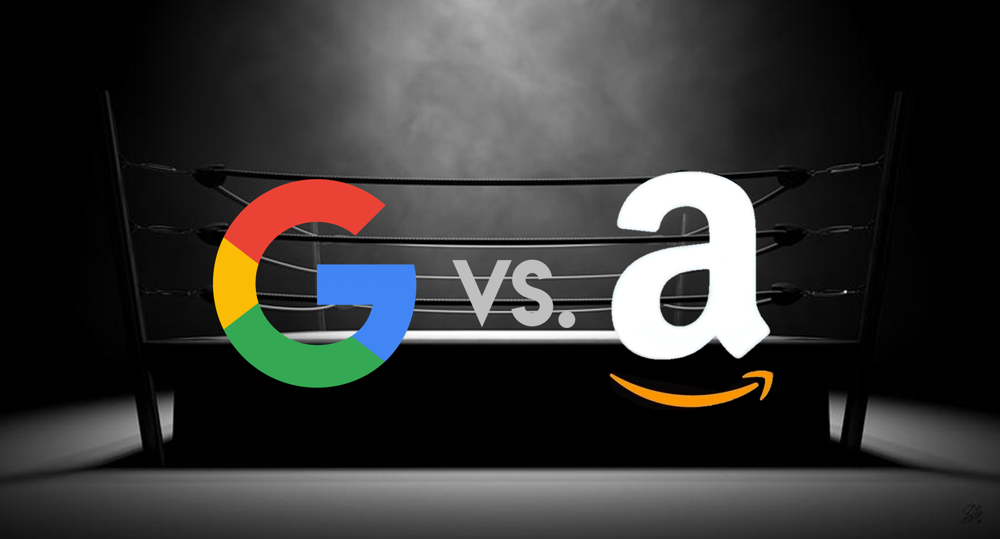
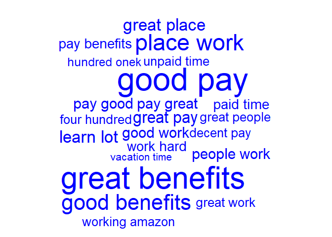
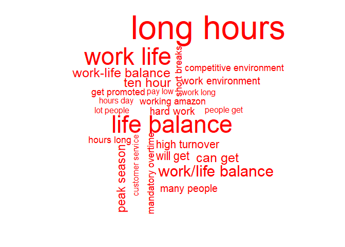
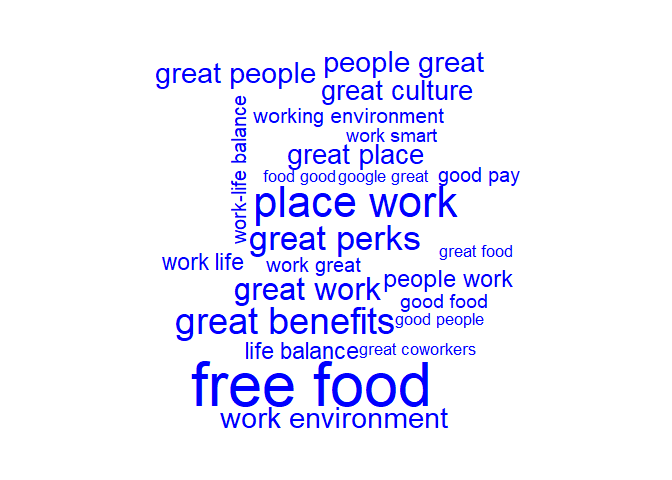
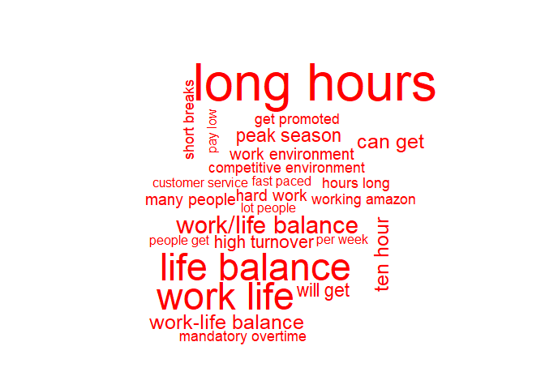
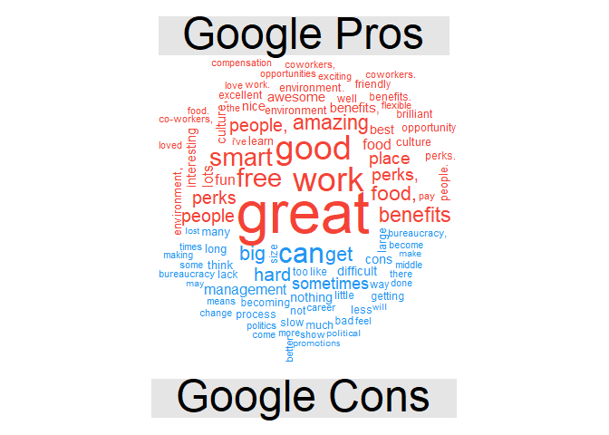
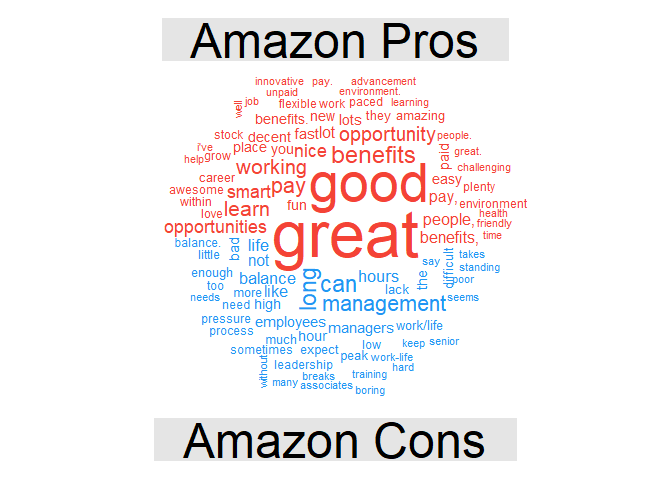
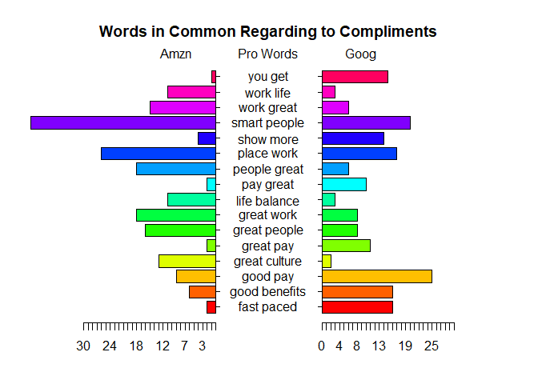
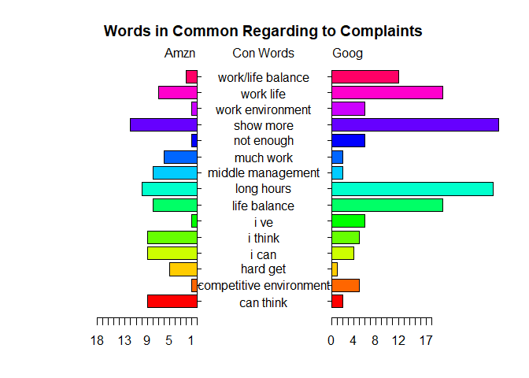

Introduction:
-------------

Learning what the opinions from targeting customers is always a good
customer-centric attitude. Competitive analysis is always informative by
conducting text mining on the feedbacks or reviews of products. To
demonstrate this point, a case in point is demonstrated. Interestingly,
the product in this case is high-tech giants and target users are the
talents. Specifically, the question here is **what one, Amazon or
Google, is better for job hunters to work with?**

In this example, several text mining techniques have been used to
explore insights. The efficacy of these tools are highly dependent on
the situations and questions a user want to answer. This analysis is
meant to demonstrate to the usage of these techniques.Feel free to use
them to another your products and competitors from your customers'
perspective. Believe me: it is sparkling!

The data sets are from [Glassdoor](https://www.glassdoor.com/index.htm),
a websites highly popular among job hunters. 500 reviews about the pros
and cons of the firms were collected in order to perform this analysis.

Main takeaways:
---------------

-   Generally, as two largest high-tech giants around world, **Google
    and Amazon are pretty similar from emoployees' persepective**: they
    both provide good pay, benefits, learning opportunities and smart
    colleagues, and yet some people are bothered by common 'big name
    problems' like fast-paced environment.

-   **Some characteristics existing differentiates the two.** Amazon has
    better work-life balance, while Google employees tend to satify
    their pay.Google are notorious for long working hours and fiercely
    competitive enviornment, while Amazon has more compliants about
    middle management.

Analysis:
---------

Good pay, benefits, growth opportunities and smart people to work with
are major reasons.

**The Pros to Work with Amazon**

However, long working hours and hard life balance are the price you pay
for woking with Amazon.

**The Cons to Work with Amazon**

Not surprisingly, high-tech giants have very samilar benefits for their
employees.However, poeple like free foods and great perks in Google
more. Cannot Amazon pay more attention to improving the quality of free
foods?

**The Pros to Work with Google**

10 hours a day?! Not bad! Chinese high tech firms ask for 996!

**The Cons to Work with Google**

Who do not like friendly paced work? However, some people enjoy steep
learning rate associated with fast paced work.

**What are most common words related to fast paced in Amazon**

<table class="table table-condensed">
<thead>
<tr>
<th style="text-align:left;">
</th>
<th style="text-align:right;">
Association.with.Fast.Paced
</th>
</tr>
</thead>
<tbody>
<tr>
<td style="text-align:left;">
paced environment
</td>
<td style="text-align:right;">
0.49
</td>
</tr>
<tr>
<td style="text-align:left;">
environments ever
</td>
<td style="text-align:right;">
0.35
</td>
</tr>
<tr>
<td style="text-align:left;">
learn fast
</td>
<td style="text-align:right;">
0.35
</td>
</tr>
<tr>
<td style="text-align:left;">
paced friendly
</td>
<td style="text-align:right;">
0.35
</td>
</tr>
<tr>
<td style="text-align:left;">
paced work
</td>
<td style="text-align:right;">
0.35
</td>
</tr>
</tbody>
</table>
You can work with smart people, have a lot of benefits and perks and
fast learning rate, while you have to deal with common problems existing
in big names, bureaucracy for example.

Pretty similar to Google, that's one reason why they are called FANG.

Surprisingly, Amazon has better work-life balance, while Google
employees are more likely to satify their pay.

    ## [1] 5.1 4.1 4.1 2.1

Google are notorious for long working hours and fiercely competitive
enviornment, while Amazon has more compliants about middle management.

    ## [1] 5.1 4.1 4.1 2.1

The Code
--------

[Check this link](https://github.com/BrandonJia/GoodPracticesofExploratoryDataAnalysis/blob/master/GoogVSAmzn/GoogvsAmzn.rmd)
