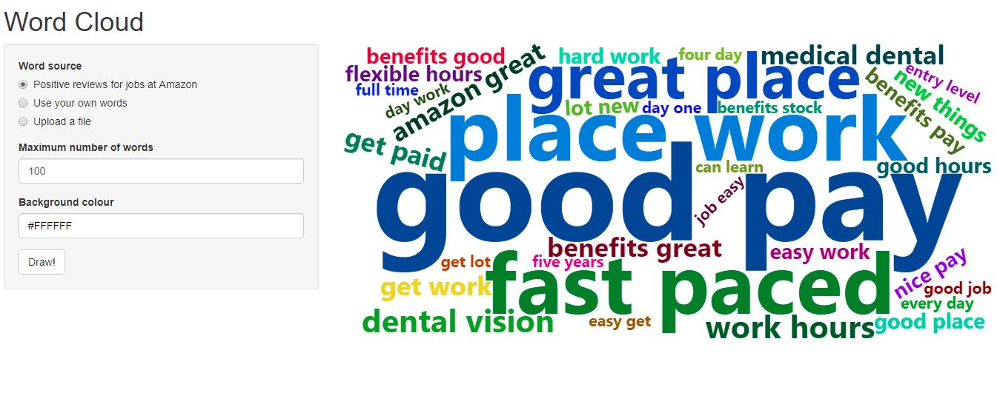

# Word Cloud App

Here is an app developed for people to efficiently perform word cloud using R. [check this hyperlink to try this app](<https://brandonola.shinyapps.io/wordcloud/>)

## Functionality

The basic mechanism is to convert transcripts into word cloud so that a user can pinpoint some insights from a large amount of textual data. 

To use it, a user needs to select a data source. The first channel is for demonstration purpose, which illustrates several reasons why Amazon employees like to work there. The other two channels are provided for users to analyze their own data.  One is to ask users to input textual data in text area, and the other is to upload a text file. 

Users also are able to set the number of words to be demonstrated in word cloud. The default setting is 100. Due to the smaller size of user-input data, the app may not be capable of drawing the sufficient number of words they set.

Last but not least, users can customize the background of cloud map. No need to remember RGB of target color. Click the bar and choose the color from  palette.

When finishing setting, click 'Draw!' and your word cloud is generated. 

Note: if you are interested in taking a look at the code, check this [repo](https://github.com/BrandonJia/GoodPracticesofExploratoryDataAnalysis/blob/master/wordcloudAppUsingRshiny/app.R) on my GitHub
